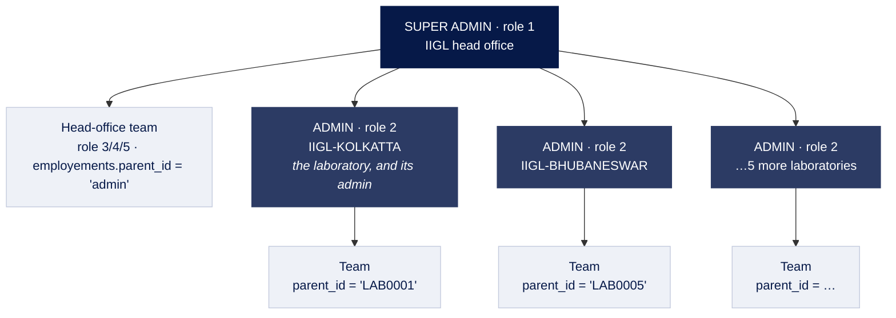
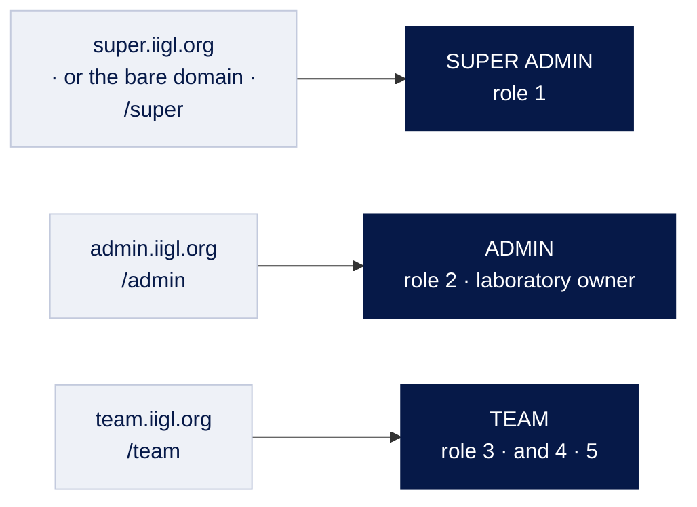

# Who can do what

Three roles, as the business names them:

| Called | In the data | Who they are |
| --- | --- | --- |
| **Super admin** | `role_id = 1`, `super admin` | IIGL head office. Owns the catalogue, the prices, the website and every laboratory. |
| **Admin** | `role_id = 2`, `admin` | **A laboratory.** The laboratory account *is* its admin — not a separate person with an account of their own. |
| **Team** | `role_id = 3`, `team` (and 4 manager, 5 office boy, both older variants) | Staff. Every team member belongs to **one** employer: a laboratory, or head office itself. |
| *(nobody)* | `role_id = NULL` | No role at all. Everything they can do was granted to them one row at a time. |

**Admin and laboratory are the same thing.** There is no laboratory table and no
separate owner account: a laboratory *is* a user with `role_id = 2`, and that
user is its admin. Anywhere the code says `isLab` and `isAdmin`, it means the
same test — both names exist so a call site can read the way the person writing
it thinks about the user.

The team layer is what makes this three roles rather than two: a team member is
not a smaller admin, they are somebody's employee, and which employer decides
what they can see.

---

## The structure



There is no table of laboratories. **A laboratory is a user** with `role_id = 2`,
and `employements.parent_id` points a team member at the user they work for —
which is why a head-office team member and a laboratory's team member are the
same kind of row with a different parent.

### Which staff work under which laboratory

`employements.parent_id` is the whole answer, and it is an **`empid`** — the
employer's `users.empid`, `'LAB0001'` — not a laboratory id and not a user id.
There is no laboratory table for it to point at, and since migration 009 it does
not point at `users.id` either.

```sql
SELECT u.fullname, p.fullname AS works_under
  FROM employements e
  JOIN users u ON u.id = e.user_id
  LEFT JOIN users p ON p.empid = e.parent_id
 WHERE e.is_working = '1';
```

`users.empid` is UNIQUE, so it identifies the employer as exactly as the primary
key would. What it does not have is a primary key's permanence: an empid can be
edited, and renaming one would leave everybody under it working for nobody. Two
things stand in for the foreign key this schema does not have —
`PATCH /api/users/{id}` refuses to change an `empid` any employment points at,
and `npm run check:parents` reports a parent no account holds.

Everything downstream of the employment — `orders.lab_id`, the scope checks, the
session's `labId` — is still keyed by **user id**, so `resolveLabId()` joins back
through `users.empid` once on sign-in and the rest of the API never sees an
empid.

Live, that is 16 working employments: 15 under six laboratories, and one under
head office.

| Works under | Staff |
| --- | --- |
| IIGL-KOLKATTA | 6 |
| IIGL-BHUBANESWAR | 3 |
| IIGL-BRAHAMPUR | 2 |
| IIGL-TATA NAGAR | 2 |
| IIGL-MALDA | 1 |
| IIGL-VARANASI | 1 |
| Head office | 1 |

Every working employment points at a user that exists, and every team member has
one — checked, not assumed.

### Where an empid comes from

Every account gets one when it is created — `POST /api/users` writes it, and the
shape is the one already in the data: a prefix, three zeros, then a running
number.

```
LAB0001, LAB0005     a laboratory     prefix LAB, role 2
EMP0007, EMP00012    everybody else   prefix EMP
```

The zeros are a literal rather than padding: `EMP00012` is `EMP` + `000` + `12`,
which is what Laravel produced and what the existing rows hold. The number is a
counter over accounts with that prefix, not a user id — user 16 holds `EMP0007`.
`nextEmpid()` reads the highest number in use rather than counting rows, because
accounts get deleted and a count would hand out an id somebody already holds.
Send `empid` on the create to choose one instead; one another account holds is
refused, as is blanking one on `PATCH /api/users/{id}`.

This is not cosmetic. An account with no empid cannot employ anybody, and does
not appear on the staff list at all, which joins through these columns — which
is exactly what happened to accounts created before the create route wrote one.

The same request also **employs** a staff account: an employment row and
`users.parent_id`, written together by `employ()`. The employer is `lab_id` when
the caller names one, otherwise the caller themselves — head office creating
staff gets head-office employees, a laboratory gets its own. A laboratory is
nobody's employee, so no employment is written for one.

### Two copies, on purpose

`users.parent_id` (migration 008) is the **current** employer on the person's
own row, so a scope check costs no join. `employements` stays the **record of
employment**: one row per posting, with the joining date, the salary and the
leave date, so somebody who moves between laboratories has a history. Both hold
the same kind of value — the employer's `empid` — so the two can be compared
without a join.

```
employements   who worked where, and when          the record
users.parent_id   who works there now              the shortcut
```

Two copies of one fact can disagree, so:

- every endpoint that changes an employment writes both, through `setEmployer()`
  — one function, so there is one place to be wrong;
- `resolveLabId()` reads the column first and **falls back to `employements`**
  when it is NULL. That is not caution for its own sake: the Laravel application
  still writes `employements` and knows nothing about the column, so until
  cutover somebody it hires would otherwise sign in belonging to nobody;
- `npm run check:parents` compares the two and prints the SQL that repairs any
  row where they differ. It changes nothing itself — a repair that runs
  unattended is how a wrong value gets copied over a right one.

Places that read the answer:

| | |
| --- | --- |
| `resolveLabId()` | On sign-in. A laboratory is its own `labId`; anyone else takes their employer's id from here. **It is what scopes every list they see.** |
| `GET /api/users/staff` | The staff list, joined back through `parent_id` to `users.empid` to name the employer — including head office, which is not on the laboratory list because that list is role 2 and head office is role 1. Each row carries the person's own `empid`, `lab_empid` as stored, and `lab_id` resolved from it. |
| `GET /api/users/laboratories` | Each laboratory with its `staff` count, so the answer reads in both directions. |

> **One row in the live data is worth knowing about.** `IIGL-TATA NAGAR` (user
> 14) is a laboratory *and* carries a working employment under
> `IIGL-BHUBANESWAR` (user 12), dated 2021-10-01. It changes nothing today:
> `resolveLabId()` returns a laboratory's own id before it looks at
> `employements`, so lab 14 scopes to itself and keeps its 2,546 orders. But it
> means the staff list shows a laboratory among Bhubaneswar's people. Either the
> employment is a leftover from how that franchise started, or it is meant —
> worth deciding before somebody writes a query that trusts every row here to be
> a team member.

```
users                                        employements
┌────┬───────────┬───────────────┬─────────┐  ┌─────────┬───────────┬────────────┐
│ id │ empid     │ fullname      │ role_id │  │ user_id │ parent_id │ is_working │
├────┼───────────┼───────────────┼─────────┤  ├─────────┼───────────┼────────────┤
│  1 │ admin     │ IIGL          │    1    │←─┼────16   │ 'admin'   │     1      │  head office
│  4 │ LAB0001   │ IIGL-KOLKATTA │    2    │←─┼────21   │ 'LAB0001' │     1      │  a laboratory
│ 16 │ EMP0007   │ CHHOTU KUMAR  │    4    │  │         │           │            │
│ 21 │ EMP00012  │ …             │    3    │  │         │           │            │
└────┴───────────┴───────────────┴─────────┘  └─────────┴───────────┴────────────┘

The arrow lands on `empid`, not on `id`.
```

---

## Three doors, one per role

Each sign-in address admits exactly one role, and is named after the role rather
than after the software.



| Address | Card reads | Admits |
| --- | --- | --- |
| `super.iigl.org`, or the bare domain | IIGL Super Admin — *Head office sign-in* | role 1 |
| `admin.iigl.org` | IIGL Admin — *Laboratory sign-in* | role 2 — the laboratory's own account |
| `team.iigl.org` | IIGL Team — *Staff sign-in* | roles 3–5 |

The bare domain is the head office door: that is who opens the panel without
being told an address. The path forms — `/super`, `/admin`, `/team` — are the
same three doors for local work, without touching DNS or a hosts file.

Right credentials at the wrong door are refused with the address to use instead:

> This sign-in is for laboratories. Head office signs in at the super admin
> address, and staff at the team address.

**The door is not the security boundary.** It decides which sign-in screen
somebody sees and which accounts it accepts; the API checks the role on every
request and would still refuse a laboratory the catalogue if it arrived by
another door. `iigl-admin/src/lib/portal.ts` holds the doors; `requireAdmin` and
`requireLabScope` hold the boundary.

---

## What each one sees

| | Super admin | Admin (laboratory) | Team |
| --- | --- | --- | --- |
| Orders, certificates, customers | Every laboratory | Own laboratory | Own laboratory, **or only their own work** — see below |
| Catalogue, prices, website, roles | Yes | No | No |
| Laboratories | All, and can create them | Own record only | No |
| Employees | All | Own laboratory's | No |
| Money | Every ledger | Own | Own |
| Students, enquiries, courses | Yes | No | No |
| Issue a certificate | **No** — head office has no laboratory to issue against | Yes | With permission |

The last row is not a policy choice. A certificate is written against the
issuer's laboratory, and role 1 has none, so `createReport` refuses with *"Your
account is not linked to a laboratory"*. The panel hides the button rather than
offering a control that cannot succeed.

**Head office reads every laboratory's orders, but has no Orders menu.** An
order is taken at a counter and head office has no counter, so the order queue
is a laboratory's menu and is left off the super admin sidebar. `GET
/api/orders` is still unscoped for role 1 and `/orders` is still a route — the
header search lands on it — so this is emphasis in the menu, not a permission.

### How far a team member sees

```
                    product_collection
                    view AND create?
                           │
              ┌────────────┴────────────┐
             yes                        no
              │                          │
   the whole laboratory's        only orders they took
   orders and certificates       or were assigned
```

Ported from `OrderController`, and `orderVisibility()` in
`src/services/permission.service.ts` is the one place it is decided.

---

## Roles are not a fixed list

Head office **and** a laboratory can create roles, and whose role it is decides
everything else about it:

| | Who sees it | Who renames or deletes it | Who sets its permissions |
| --- | --- | --- | --- |
| The five built-in roles | Everyone | **Nobody** | Head office |
| A head-office role | Every laboratory | Head office | Head office |
| A laboratory's own role | That laboratory | That laboratory | That laboratory |

The five that shipped cannot be renamed or deleted because code branches on 1
and 2 by number, and role 3 is what every existing employee holds. Their
permissions are still editable — that is the matrix this system ported.

A laboratory owning its own roles is the point: without it, one laboratory
renaming "Front desk" would rename it for six others.

## Permissions

`role_permissions` holds one row per role per action type.

**It describes the team, and only the team.** Every row for role 1 and role 2 is
zero, and the Laravel laboratory sidebar never reads them: the controllers branch
on `role_id == 2` before they ever call `filterPermission()`. Read literally, the
zeros would lock a laboratory out of its own counter.

So `can()` returns true unconditionally for role 1 and role 2, and consults the
matrix for role 3 and above.

```
role 1  super admin     0 flags set   ← never read; unconditional
role 2  admin           0 flags set   ← never read; unconditional
role 3  team           38 flags set   ← the matrix means this
role 4  MANAGER         0 flags set   ← see the warning below
role 5  Office Boy      0 flags set   ← no users hold this role
NULL    no role         —             ← only their own grants
```

### NULL is not a role

`role_id` is nullable, and NULL means **no role**: somebody whose permissions
were granted one row at a time in `user_permissions`.

Nothing coerces a role through `Number()`. `Number(null)` is `0`, and while 0 is
not a role today, a decoder that turns "no role" into a number is one schema
change away from turning it into somebody's role. The session decoder and the
login both keep null as null for that reason.

Custom roles take any id above the built-in five, so **rank tests are written as
sets, not inequalities** — `isSuper()`, `isAdmin()`, or an explicit pair — and
never `roleId <= 2`.

### The permission list can grow

The fourteen action types live in `permission_actions` rather than in a
constant, so a new one can be added without a deployment — `POST
/api/roles/actions`, head office only.

**There is no button for it in the panel.** It was removed deliberately: adding
a name puts it on every role's screen while granting nothing, because the API
does not check it until somebody writes the check. That is a decision to make
alongside the code that reads it, not from a form. The permission screens still
read the list rather than a constant, and still mark anything the API does not
enforce as **not enforced yet**.

### One person's own permissions

A grant on `user_permissions` **replaces** the role's answer for that action.
That cuts both ways, deliberately:

```
      role says          the person's own row       what happens
      ─────────────────────────────────────────────────────────────
      view, create       —                          view, create
      view, create       nothing ticked             nothing
      —                  view                       view
      (no role at all)   view                       view
```

Which is what makes **a user with no role** work: `role_id` is NULL, they have
no role rows, and their own grants are all there is. `can()` resolves own-grant, then role,
then deny — the same order on every request, so a screen that hides a control on
this answer hides exactly what the API would refuse.

> **Worth deciding before cutover.** Role 4 (MANAGER) has one live user, and they
> are head office's employee — `employements.parent_id = 'admin'`, head
> office's own empid. Every one of their
> permission flags is zero, so the matrix grants them nothing, and
> `orderVisibility()` puts them on "only their own work". Either give role 4 its
> flags, or fold that person into role 3. Right now they can sign in and see
> almost nothing.

---

## Live counts

From the production copy, at the time of writing:

| Role | Users | Active |
| --- | --- | --- |
| 1 · super admin | 2 | 2 |
| 2 · admin (a laboratory) | 7 | 6 |
| 3 · team | 14 | 11 |
| 4 · MANAGER | 1 | 1 |
| 5 · Office Boy | 0 | — |

Seven laboratories: Kolkata, Malda, Varanasi, Brahampur, Bhubaneswar, Tata Nagar,
and one test account. Fourteen team members across them, one of whom reports to
head office rather than to a laboratory.

---

## Where this is enforced

| Rule | File |
| --- | --- |
| Which roles each door admits | `iigl-admin/src/lib/portal.ts` |
| Role narrowing in the panel | `isSuper()` for head office, `isAdmin()` — the same test as `isLab()` — for a laboratory, same file |
| Which menu a role sees | `ADMIN_GROUPS` / `FIELD_GROUPS` in `iigl-admin/src/components/Shell.tsx` |
| Session role and laboratory | `resolveLabId()` in `iigl-node/src/middleware/auth.ts` |
| Administrator-only routes | `requireAdmin` |
| Laboratory scoping | `requireLabScope`, `assertLabOwnership` |
| How far a team member sees | `orderVisibility()` in `iigl-node/src/services/permission.service.ts` |

The panel hides what a role cannot use. The API refuses it. Both are needed: the
first is courtesy, the second is the boundary.
