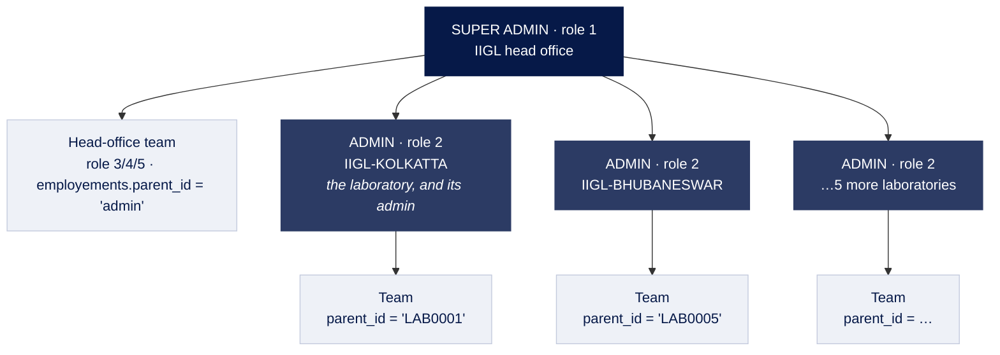
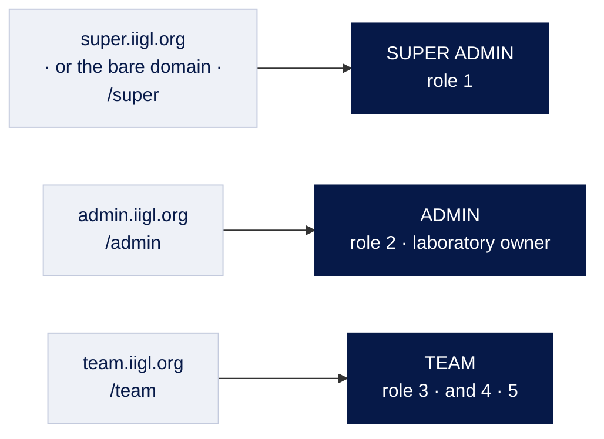

# Who can do what

Three roles, as the business names them:

| Called | In the data | Who they are |
| --- | --- | --- |
| **Super admin** | `role_id = 1`, `super admin` | IIGL head office. Owns the catalogue, the prices, the website and every laboratory. |
| **Admin** | `role_id = 2`, `admin` | **A laboratory.** The laboratory account *is* its admin — not a separate person with an account of their own. |
| **Team** | `role_id = 3`, `team` (and 4 manager, 5 office boy, both older variants) | Staff. Every team member belongs to **one** employer: a laboratory, or head office itself. |
| *(nobody)* | `role_id = NULL` | No role at all. Everything they can do was granted to them one row at a time. |

**Admin and laboratory are the same thing.** There is no laboratory table and no
separate owner account: a laboratory *is* a user with `role_id = 2`, and that
user is its admin. Anywhere the code says `isLab` and `isAdmin`, it means the
same test — both names exist so a call site can read the way the person writing
it thinks about the user.

The team layer is what makes this three roles rather than two: a team member is
not a smaller admin, they are somebody's employee, and which employer decides
what they can see.

---

## The structure



There is no table of laboratories. **A laboratory is a user** with `role_id = 2`,
and `employements.parent_id` points a team member at the user they work for —
which is why a head-office team member and a laboratory's team member are the
same kind of row with a different parent.

### Which staff work under which laboratory

`employements.parent_id` is the whole answer, and it is an **`empid`** — the
employer's `users.empid`, `'LAB0001'` — not a laboratory id and not a user id.
There is no laboratory table for it to point at, and since migration 009 it does
not point at `users.id` either.

```sql
SELECT u.fullname, p.fullname AS works_under
  FROM employements e
  JOIN users u ON u.id = e.user_id
  LEFT JOIN users p ON p.empid = e.parent_id
 WHERE e.is_working = '1';
```

`users.empid` is UNIQUE, so it identifies the employer as exactly as the primary
key would. What it does not have is a primary key's permanence: an empid can be
edited, and renaming one would leave everybody under it working for nobody. Two
things stand in for the foreign key this schema does not have —
`PATCH /api/users/{id}` refuses to change an `empid` any employment points at,
and `npm run check:parents` reports a parent no account holds.

Everything downstream of the employment — `orders.lab_id`, the scope checks, the
session's `labId` — is still keyed by **user id**, so `resolveLabId()` joins back
through `users.empid` once on sign-in and the rest of the API never sees an
empid.

Live, that is 16 working employments: 15 under six laboratories, and one under
head office.

| Works under | Staff |
| --- | --- |
| IIGL-KOLKATTA | 6 |
| IIGL-BHUBANESWAR | 3 |
| IIGL-BRAHAMPUR | 2 |
| IIGL-TATA NAGAR | 2 |
| IIGL-MALDA | 1 |
| IIGL-VARANASI | 1 |
| Head office | 1 |

Every working employment points at a user that exists, and every team member has
one — checked, not assumed.

### Where an empid comes from

Every account gets one when it is created — `POST /api/users` writes it, and the
shape is the one already in the data: a prefix, three zeros, then a running
number.

```
LAB0001, LAB0005     a laboratory     prefix LAB, role 2
EMP0007, EMP00012    everybody else   prefix EMP
```

The zeros are a literal rather than padding: `EMP00012` is `EMP` + `000` + `12`,
which is what Laravel produced and what the existing rows hold. The number is a
counter over accounts with that prefix, not a user id — user 16 holds `EMP0007`.
`nextEmpid()` reads the highest number in use rather than counting rows, because
accounts get deleted and a count would hand out an id somebody already holds.
Send `empid` on the create to choose one instead; one another account holds is
refused, as is blanking one on `PATCH /api/users/{id}`.

This is not cosmetic. An account with no empid cannot employ anybody, and does
not appear on the staff list at all, which joins through these columns — which
is exactly what happened to accounts created before the create route wrote one.

The same request also **employs** a staff account: an employment row and
`users.parent_id`, written together by `employ()`. The employer is `lab_id` when
the caller names one, otherwise the caller themselves — head office creating
staff gets head-office employees, a laboratory gets its own. A laboratory is
nobody's employee, so no employment is written for one.

### Two copies, on purpose

`users.parent_id` (migration 008) is the **current** employer on the person's
own row, so a scope check costs no join. `employements` stays the **record of
employment**: one row per posting, with the joining date, the salary and the
leave date, so somebody who moves between laboratories has a history. Both hold
the same kind of value — the employer's `empid` — so the two can be compared
without a join.

```
employements   who worked where, and when          the record
users.parent_id   who works there now              the shortcut
```

Two copies of one fact can disagree, so:

- every endpoint that changes an employment writes both, through `setEmployer()`
  — one function, so there is one place to be wrong;
- `resolveLabId()` reads the column first and **falls back to `employements`**
  when it is NULL. That is not caution for its own sake: the Laravel application
  still writes `employements` and knows nothing about the column, so until
  cutover somebody it hires would otherwise sign in belonging to nobody;
- `npm run check:parents` compares the two and prints the SQL that repairs any
  row where they differ. It changes nothing itself — a repair that runs
  unattended is how a wrong value gets copied over a right one.

Places that read the answer:

| | |
| --- | --- |
| `resolveLabId()` | On sign-in. A laboratory is its own `labId`; anyone else takes their employer's id from here. **It is what scopes every list they see.** |
| `GET /api/users/staff` | The staff list, joined back through `parent_id` to `users.empid` to name the employer — including head office, which is not on the laboratory list because that list is role 2 and head office is role 1. Each row carries the person's own `empid`, `lab_empid` as stored, and `lab_id` resolved from it. |
| `GET /api/users/laboratories` | Each laboratory with its `staff` count, so the answer reads in both directions. |

> **One row in the live data is worth knowing about.** `IIGL-TATA NAGAR` (user
> 14) is a laboratory *and* carries a working employment under
> `IIGL-BHUBANESWAR` (user 12), dated 2021-10-01. It changes nothing today:
> `resolveLabId()` returns a laboratory's own id before it looks at
> `employements`, so lab 14 scopes to itself and keeps its 2,546 orders. But it
> means the staff list shows a laboratory among Bhubaneswar's people. Either the
> employment is a leftover from how that franchise started, or it is meant —
> worth deciding before somebody writes a query that trusts every row here to be
> a team member.

```
users                                        employements
┌────┬───────────┬───────────────┬─────────┐  ┌─────────┬───────────┬────────────┐
│ id │ empid     │ fullname      │ role_id │  │ user_id │ parent_id │ is_working │
├────┼───────────┼───────────────┼─────────┤  ├─────────┼───────────┼────────────┤
│  1 │ admin     │ IIGL          │    1    │←─┼────16   │ 'admin'   │     1      │  head office
│  4 │ LAB0001   │ IIGL-KOLKATTA │    2    │←─┼────21   │ 'LAB0001' │     1      │  a laboratory
│ 16 │ EMP0007   │ CHHOTU KUMAR  │    4    │  │         │           │            │
│ 21 │ EMP00012  │ …             │    3    │  │         │           │            │
└────┴───────────┴───────────────┴─────────┘  └─────────┴───────────┴────────────┘

The arrow lands on `empid`, not on `id`.
```

---

## Three doors, one per role

Each sign-in address admits exactly one role, and is named after the role rather
than after the software.



| Address | Card reads | Admits |
| --- | --- | --- |
| `super.iigl.org`, or the bare domain | IIGL Super Admin — *Head office sign-in* | role 1 |
| `admin.iigl.org` | IIGL Admin — *Laboratory sign-in* | role 2 — the laboratory's own account |
| `team.iigl.org` | IIGL Team — *Staff sign-in* | roles 3–5 |

The bare domain is the head office door: that is who opens the panel without
being told an address. The path forms — `/super`, `/admin`, `/team` — are the
same three doors for local work, without touching DNS or a hosts file.

Right credentials at the wrong door are refused with the address to use instead:

> This sign-in is for laboratories. Head office signs in at the super admin
> address, and staff at the team address.

**The door is not the security boundary.** It decides which sign-in screen
somebody sees and which accounts it accepts; the API checks the role on every
request and would still refuse a laboratory the catalogue if it arrived by
another door. `iigl-admin/src/lib/portal.ts` holds the doors; `requireAdmin` and
`requireLabScope` hold the boundary.

---

## What each one sees

| | Super admin | Admin (laboratory) | Team |
| --- | --- | --- | --- |
| Orders, certificates, customers | Every laboratory | Own laboratory | Laboratory staff: own laboratory by grant, **or only their own orders** — see below. Head office staff: customers by grant |
| Catalogue, prices, website, roles | Yes | No | Head office staff: website setup by grant. Never catalogue, prices or roles |
| Laboratories | All, and can create them | Own record only | Head office staff: view all, by grant |
| Employees | All | Own laboratory's | No |
| Money | Own account by default — see below | Own | Own |
| Students, enquiries, courses | Yes | No | Head office staff: the enquiry book and student enquiries, by grant |
| Issue a certificate | **No** — head office has no laboratory to issue against | Yes | With permission |

The last row is not a policy choice. A certificate is written against the
issuer's laboratory, and role 1 has none, so `createReport` refuses with *"Your
account is not linked to a laboratory"*. The panel hides the button rather than
offering a control that cannot succeed.

**Head office reads every laboratory's orders, but has no Orders menu.** An
order is taken at a counter and head office has no counter, so the order queue
is a laboratory's menu and is left off the super admin sidebar. `GET
/api/orders` is still unscoped for role 1 and `/orders` is still a route — the
header search lands on it — so this is emphasis in the menu, not a permission.

### Money: an account's history is its own, head office included

`GET /api/transactions` answers *"my transactions"* — the rows this account
sent or received — and it answers it the same way for every role.

Head office was once left unfiltered here, on the reasoning that an
administrator may see everything. What that produced was head office's
Transaction History listing a laboratory's own money: the collections its staff
took at the counter, and the wallet transfers between them. Head office is a
party to neither, and neither belongs in its history.

Seeing more than your own is a different question, and is asked deliberately:

```
GET /api/transactions?scope=all      every transaction in the system
GET /api/transactions?user_id=26     one account's history
GET /api/transactions/ledger?user_id=26
```

Both are head office's alone, and both are **ignored** rather than refused for
anybody else — a laboratory asking for everything is asking for its own.

**"Unscoped for role 1" is not the default.** It is right for the screens that
are *about* the network — `/commission/summary` and `/commission/earnings` sum
every laboratory's accrual because that is the figure head office is owed — and
wrong for every screen that shows an account its own records. When adding an
endpoint, decide which of the two it is before writing the query, and say so in
its docstring.

### How far a team member sees

```
                    product_collection
                    view AND create?
                           │
              ┌────────────┴────────────┐
             yes                        no
              │                          │
   the whole laboratory's        only orders they took
   orders and certificates       or were assigned
```

Ported from `OrderController`, and `orderVisibility()` in
`src/services/permission.service.ts` is the one place it is decided.

---

## Roles are not a fixed list

Head office **and** a laboratory can create roles, and whose role it is decides
everything else about it:

| | Who sees it | Who renames or deletes it | Who sets its permissions |
| --- | --- | --- | --- |
| The five built-in roles | Everyone | **Nobody** | Head office |
| A head-office role | Every laboratory | Head office | Head office |
| A laboratory's own role | That laboratory | That laboratory | That laboratory |

The five that shipped cannot be renamed or deleted because code branches on 1
and 2 by number, and role 3 is what every existing employee holds. Their
permissions are still editable — that is the matrix this system ported.

A laboratory owning its own roles is the point: without it, one laboratory
renaming "Front desk" would rename it for six others.

## Permissions

Permissions govern **employees, and only employees**. Head office (role 1) and a
laboratory (role 2) are unconditional — the laboratory account *is* its admin,
and every role 1 and role 2 row in the ported `role_permissions` is zero. Read
literally those zeros would lock a laboratory out of its own counter, so
`can()` returns true for both and consults the matrix for everybody else.

### Who sets them

```
                      whose permissions it may set
    ──────────────────────────────────────────────────────────────
    Super admin       any employee — its own staff and every laboratory's
    Laboratory        its own staff only
    An employee       nobody, not even themselves
```

Every write — a role's matrix, a role's name, one person's own grants — takes
`requireEmployer`, and nobody may read or change their own permissions. Head
office and laboratory accounts have no permissions to set (403).

> **This was once a hole.** The permission and role endpoints admitted
> employees, and an employee's "laboratory" is their employer — so they passed
> the *works for your laboratory* test for every colleague and for themselves,
> and could create a role, grant it everything, and grant themselves anything.

### Two kinds of employee, two sets of permissions

What an employee may be given depends on **whose** employee they are
(`staffKindOf()`, from the employer the session's `labId` points at):

| Permission | Laboratory staff | Head office staff | Boxes | What the API enforces |
| --- | :-: | :-: | --- | --- |
| `product_collection` Orders | ✓ | | View Add Edit Delete | View+Add together show the laboratory's orders, else only their own; Add takes an order; Edit settles, delivers, amends; Delete removes an order or item |
| `report` Certificates | ✓ | | View Add Edit | List and print (incl. card PDFs); issue; edit and hide. Never deleted |
| `customer` Customers | ✓ | ✓ | View Add Edit Delete | Lists and registered accounts. Head office staff see every laboratory's |
| `laboratory` Laboratories | | ✓ | View | Franchise list, laboratory page, agreement, registration form. Changing a laboratory stays Super Admin's |
| `visitor_book` Enquiry book | | ✓ | View Add Edit Delete | `/api/enquiries`, with follow-ups |
| `website_enquiry` Student enquiries | | ✓ | View Add Edit Delete | `/api/students/enquiries`; convert is Edit. The rest of the student pipeline stays Super Admin's |
| `website_home` Website setup | | ✓ | View Add Edit Delete | Banners, pages, branch pages, which laboratories and customers the website shows |
| `website_report` Report types | | ✓ | View Add Edit | Website Setup › Report Types |
| `website_blog` Blog | | ✓ | View Add Edit | Website Setup › Blog |

`PERMISSION_SCOPE` in `iigl-node/src/services/permission.service.ts` is this
table. A grant outside the person's side, or on a box the permission does not
use, is worth nothing — `can()` answers no — and the write endpoints refuse the
first and store the second as off. That matters because role 3 **Team** is
shared by both kinds: its website flags must not reach a laboratory's front desk,
and its order flags must not reach head office's staff.

**Not employee permissions**, and on no permission screen: `account`,
`employee_management`, `admin_employee`, `website_contact`,
`website_education` (nothing to govern — managing money and people is the
employer's), and `attendance` and `message` — a person's own month and their
own messages to their employer are always theirs.

### How it is enforced

```
requirePermission(action, ability?)   laboratory routes: head office and
                                      laboratories pass; an employee needs it
headOfficeOr(action, ability?)        head office's routes: head office passes,
                                      and its own staff holding it; a
                                      laboratory or its staff never
```

The ability defaults to the request method — GET view, POST add, PATCH/PUT
edit, DELETE delete. Each route file shows its guard beside the path.

### Head office's employees

They sign in at the team door, and the panel gives them **head office's** menu
cut down to what they hold (`staff_of` on `/api/users/me/permissions`), plus
their own Attendance page. Screens they can open show only the buttons their
grant allows; anything without a permission — prices, masters, settings,
courses, employees, roles — stays Super Admin's.

### Roles and one person's own grants

A laboratory's own role governs laboratory staff, so its screen lists the
laboratory side. A shared role may be held by either kind and lists both, each
row marked with the side it applies to.

A grant on `user_permissions` **replaces** the role's answer for that
permission. That cuts both ways, deliberately:

```
      role says          the person's own row       what happens
      ─────────────────────────────────────────────────────────────
      view, create       —                          view, create
      view, create       nothing ticked             nothing
      —                  view                       view
      (no role at all)   view                       view
```

`can()` resolves: head office or laboratory → yes; permission not for this
side or box not used → no; own row; role row; no. The same order on every
request, and `/api/users/me/permissions` returns that same answer, so a
control the panel hides is exactly one the API refuses.

### NULL is not a role

`role_id` is nullable, and NULL means **no role**: somebody whose permissions
were granted one row at a time in `user_permissions`. Nothing coerces a role
through `Number()` — `Number(null)` is `0` — and custom roles take any id above
the built-in five, so rank tests are written as sets (`isSuper()`, `isLab()`),
never `roleId <= 2`.

### The live data, when this was written

```
role 3  Team          shared   laboratory side and head-office side both set
role 9  Office Boy    lab 26   Orders view + add only
user 25 (head office staff, Team)       own grant: Laboratories view
users 31, 33 (lab 26 staff, Office Boy) Orders only — no certificates or customers
```

---

## Live counts

From the production copy, at the time of writing:

| Role | Users | Active |
| --- | --- | --- |
| 1 · super admin | 2 | 2 |
| 2 · admin (a laboratory) | 7 | 6 |
| 3 · team | 14 | 11 |
| 4 · MANAGER | 1 | 1 |
| 5 · Office Boy | 0 | — |

Seven laboratories: Kolkata, Malda, Varanasi, Brahampur, Bhubaneswar, Tata Nagar,
and one test account. Fourteen team members across them, one of whom reports to
head office rather than to a laboratory.

---

## Where this is enforced

| Rule | File |
| --- | --- |
| Which roles each door admits | `iigl-admin/src/lib/portal.ts` |
| Role narrowing in the panel | `isSuper()` for head office, `isAdmin()` — the same test as `isLab()` — for a laboratory, same file |
| Which menu a role sees | `ADMIN_GROUPS` / `FIELD_GROUPS` in `iigl-admin/src/components/Shell.tsx` |
| Session role and laboratory | `resolveLabId()` in `iigl-node/src/middleware/auth.ts` |
| Administrator-only routes | `requireAdmin` |
| Laboratory scoping | `requireLabScope`, `assertLabOwnership` |
| How far a team member sees | `orderVisibility()` in `iigl-node/src/services/permission.service.ts` |
| Employer scoping — a laboratory acting on its own staff | `requireEmployer`, `assertEmploys` |
| Whose money a screen shows | the `scope`/`user_id` branch in `iigl-node/src/routes/transaction.routes.ts` |

The panel hides what a role cannot use. The API refuses it. Both are needed: the
first is courtesy, the second is the boundary.

### A person's own record is not a grant

Attendance was behind `attendance.view`. A laboratory's new role starts with no
grants at all, so its holder could punch in from the clock in the header — which
asks nobody — and then had nowhere to read back what they had punched.

Anybody who may clock in may read their own month. That is one fact stated
twice, not two decisions, and the menu no longer asks. What still needs a grant
is somebody *else's* month, and that is a different screen: an employer reads
its people on their pages, guarded by `assertEmploys` at the API. Migration 037
corrects what the grant's description claims to govern.

The test to apply to the next one: does the permission decide what somebody may
do *to another person's records*, or does it decide whether they can see their
own? Only the first is a permission.

### Two rules that have each been broken once

**Read and write must be guarded alike.** `GET /api/users/{id}` was
administrator-only while `PATCH` on the same id took `requireEmployer`, so a
laboratory could save an employee it was not allowed to fetch — and pressing
Edit answered *"Requires super admin access"* from the request that fills the
form. Whoever may change a record may read it; give both the same guard and the
same per-record check.

**"Head office sees everything" is a decision, not a default.** See *Money*
above. Ask of each new endpoint whether it is about the network or about the
account asking, and write the answer in its docstring before writing the
query.
